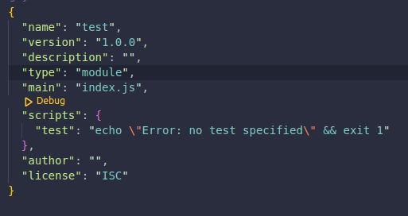

# Termax

#### _Build Node CLI's in minutes_

Termax is a wrapper library around exec, execFile, fork and spawn child processes which allows you to call async child processes sequentially.

## Features

- Built in spinner
- Built in error handling
- Themes and custom styling
- OS Fallbacks

## Table of Contents

1.  [Documentation](#documentation)
    1.  [Installation](#installation)
    2.  [Dependencies](#dependencies)
    3.  [Importing](#importing)
    4.  [tExec](#tExec)
    5.  [tExecFile](#tExecFile)
    6.  [tFork](#tFork)
    7.  [tSpawn](#tSpawn)
    8.  [Chain](#chain)
    9.  [Error Handling](#error_handling);
    10. [Configuration](#configuration)
2.  [Styling](#styling)
    1.  [Themes](#themes)
    2.  [Custom Styling](#custom_styling)
3.  [Support](#support)

## [Documentation](#documentation)

<a name="documentation"></a>

### Installation

<a name="installation"></a>

```sh
npm install --save @dynamize/termax
```

### Dependencies

<a name="dependencies"></a>

| Dependency  | README                                                     |
| ----------- | ---------------------------------------------------------- |
| chalk       | [https://github.com/chalk/chalk#readme][PlDb]              |
| inquirer    | [https://github.com/SBoudrias/Inquirer.js#readme][PlGh]    |
| log-symbols | [https://github.com/sindresorhus/log-symbols#readme][PlGd] |
| ora         | [https://github.com/sindresorhus/ora#readme][PlOd]         |

### Importing

<a name="importing"></a>

```javascript
import {tExec, tExecFile, tFork, tSpawn} from '@dynamize/termax';
```
#### Teramx only supports ECMAScript imports, and has no support for CommonJS.
#### Which means you need to setup your project with the type of a module in package.json:

### tExec

<a name="tExec"></a>

tExec is a wrapper around exec from child_process with the nuance that it can execute a sequence of exec calls. This is useful when one wants to execute multiple exec call in an order and have a spinner working on each call without pauses.
Let's see a simple usage case:

```javascript
import {tExec} from '@dynamize/termax';

tExec([{cmd: 'sleep 3'}]);
```

This will execute a simple sleep command for 3 seconds, the style will fall back to default as we didn't specify it (more on styling in styling section).
tExec takes two arguments, a configs(array of config objects) argument and an optional callback. The only must is a cmd property in the config argument. (More on config in config section).

Let's take a look at a callback example:

```javascript
import {tExec} from '@dynamize/termax';

const calls = [
  {
    cmd: 'sleep 3'
  },
  {
    cmd: 'sleep 3',
    spinner: {
      style: 'cold'
    }
  },
  {
    cmd: 'sleep 3',
    spinner: {
      style: 'sunrise'
    }
  }
];

tExec(calls, () => {
  console.log('All done!');
});
```
#### Output from the code above:

### tExecFile

<a name="tExecFile"></a>

tExecFile is a wrapper around execFile from child_process, it takes two arguments: configs(array of config objects) and the optional callback function. What is always required is the cmd and args properties in configs argument, where cmd is an environment in which to execute the file (node, python etc..), and args will take the file name. Let's see an example:

```javascript
import {tExecFile} from '@dynamize/termax';

const calls = [
  {
    cmd: 'node',
    args: ['./example.js']
  },
  {
    cmd: 'node',
    args: ['./example.js'],
    spinner: {
      style: 'cold'
    }
  },
  {
    cmd: 'node',
    args: ['./example.js'],
    spinner: {
      style: 'sunrise'
    }
  }
];

tExecFile(calls, () => {
  console.log('All Done');
});
```

example.js

```javascript
import {exec} from 'child_process';

exec('ping 8.8.8.8 -c 4');
```
#### Output from the code above:

### tFork

<a name="tFork"></a>

tFork is a wrapper around fork from child_process, it also takes two arguments configs(array of config objects) and an optional callback function, with the only required property in configs being cmd, which will take the name of the file to be executed. Example:

```javascript
import {tFork} from '@dynamize/termax';

const calls = [
  {
    cmd: './test.js'
  },
  {
    cmd: './test.js',
    spinner: {
      style: 'cold'
    }
  },
  {
    cmd: './test.js',
    spinner: {
      style: 'sunrise'
    }
  }
];

tFork(calls, () => {
  console.log('All Done');
});
```

example.js

```javascript
import {exec} from 'child_process';

exec('ping 8.8.8.8 -c 4');
```
#### Output from the code above:

### tSpawn

<a name="tSpawn"></a>
tSpawn is a wrapper around spawn from child_process like all other termax wrappers. It also takes two arguments, configs(array of config objects) and an optional callback function, and it always requires the cmd and args properties.Example:

```javascript
import {tSpawn} from '@dynamize/termax';

const calls = [
  {
    cmd: 'sleep',
    args: ['3']
  },
  {
    cmd: 'slep',
    args: ['3'],
    spinner: {
      style: 'sunrise'
    }
  },
  {
    cmd: 'sleep',
    args: ['3'],
    spinner: {
      style: 'vivid'
    }
  }
];

tSpawn(calls, () => {
  console.log('All Done');
});
```
#### Output from the code above:

### Chain

<a name="chain"></a>

### Cahin API

| Name         | Description                                                                                                                                                       |
| ------------ | ----------------------------------------------------------------------------------------------------------------------------------------------------------------- |
| addToChain   | Method which adds an execution sequence to chain takes three arguments: child process name (type string), configs(config array) and an optional callback function |
| isExecuting  | A getter which returns a boolean                                                                                                                                  |
| executeChain | Method which executes a chain.                                                                                                                                    |
| callback     | A setter whict sets a callback to be executed at the end of the chain                                                                                             |


### Cahin Use Case

Chain is a class allowing you to chain together multiple different execution sequences. Let's say you want to execute three commands in a sequence and you choose tSpawn to do so, but then you would like to execute a file(maybe generated by one of the commands), now if you try to call tSpawn and right under it tFork, both these will start to execute almost simultaneously. The reason being that each execution in both tSpawn and tFork are async and as such, they will execute side by side there for both execution sequence of tSpawn and tFork will execute side by side.Chain fixes this by allowing to chain together these execution sequences. Let's see this in an example:

```javascript
import {Chain} from '@dynamize/termax';

const calls1 = [
  {
    cmd: 'sleep',
    args: ['3']
  },
  {
    cmd: 'sleep',
    args: ['3'],
    spinner: {
      style: 'sunrise'
    }
  },
  {
    cmd: 'sleep',
    args: ['3'],
    spinner: {
      style: 'vivid'
    }
  }
];

const calls2 = [
  {
    cmd: './test.js'
  },
  {
    cmd: './test.js',
    spinner: {
      style: 'cold'
    }
  },
  {
    cmd: './test.js',
    spinner: {
      style: 'sunrise'
    }
  }
];

const chain = new Chain();
chain.addToChain('spawn', calls1);
chain.addToChain('fork', calls2);
chain.executeChain();
```
#### Output from the code above:

#### Setting callbacks on a chain

There a multiple ways to set a callback on a chain.
We can use a setter:

```javascript
import {Chain} from '@dynamize/termax';
// calls1 and calls2 declared here...
const chain = new Chain();
chain.addToChain('spawn', calls1);
chain.addToChain('fork', calls2);
chain.callback = () => {
  console.log('All Done');
};
chain.executeChain();
```

Or we can give it as an argument in addToChain:

```javascript
import {Chain} from '@dynamize/termax';
// calls1 and calls2 declared here...
const chain = new Chain();
chain.addToChain('spawn', calls1);
chain.addToChain('fork', calls2, () => {
  console.log('All Done');
});
chain.executeChain();
```
#### Output from the code above:


What we need to keep in mind is that only one callback can be set on a chain.That will be the last callback given:

```javascript
import { Chain } from '@dynamize/termax';
// calls1 and calls2 declared here...
const chain = new Chain();
chain.addToChain('spawn', calls1, () => {
  console.log('Done #1')
})
chain.addToChain('fork', calls2, () => {
  console.log('Done #2')
});
chain.callback = () => {
  console.log('Done #3');
}
chain.executeChain();
// At the end we only get Done #3 printed out
```
#### Output from the code above:

#### Chain saftey integration

Once executeChain is called a chain, it can't be called again. You need to set up your chain ahead of executing it, any later alterations to it will be ignored:

```javascript
import {Chain} from '@dynamize/termax';
// calls1, calls2 and calls3 declared here...
const chain = new Chain();
chain.addToChain('spawn', calls1);
chain.addToChain('fork', calls2);
chain.executeChain();
chain.addToChain('exec', calls3);
chain.executeChain();
// Only spawn and fork execution sequence are executed
```

## Error Handling

<a name="error_handling"></a>

All termax wrappers come with built-in error handling. By default, it is turned off and you will simply be prompted that there was an error, but the execution sequence will continue:

```javascript
import {tExec} from '@dynamize/termax';

const calls = [
  {
    cmd: 'sleep 3'
  },
  {
    cmd: 'slep 3',
    sinner: {
      style: 'cold'
    }
  },
  {
    cmd: 'sleep 3',
    spinner: {
      style: 'sunrise'
    }
  }
];

tExec(calls, () => {
  console.log('All done!');
});
```
#### Output from the code above:


But we can change this by adding a handleErrors: true to our config:

```javascript
import { tExec } from '@dynamize/termax';

const calls = [
  {
    cmd: "sleep 3"
  },
  {
    cmd: "slep 3",
    handleErrors: true,
    spinner: {
      style: "cold"
    },
  },
    {
    cmd: "sleep 3",
    spinner: {
      style: "sunrise",
    },
  },
];

tExec(calls, () => {
  console.log('All done!')
});
```
#### Output from the code above:


This will stop the execution sequence and prompt the user to choose between: Continue, See Error or Abort, giving users more control.

## Configuration

<a name="configuration"></a>
Configurations that termax wrappers take can be as simple or as complicated as you desire and can get quite a bit more expensive. Here is how a full config would look:

```javascript
import {tExec} from '@dynamize/termax';

const call = [
  {
    cmd: 'sleep 3',
    args: [],
    handleErrors: true,
    spinner: {
      spinner: 'arrow3',
      style: 'system',
      spawnText: {
        prefix: 'Sleep Starts',
        text: 'Sleeping for 3 sec'
      },
      succeedText: {
        prefix: 'Sleep ended',
        text: 'Woken up'
      },
      errorText: {
        prefix: 'Something disturbed me',
        text: "I guess I'm aweak now"
      },
      color: 'red',
      indent: 4
    }
  }
];

tExec(call);
```
#### Output from the code above:

##### cmd

Type: `string`
In tExec, tExecFile and tSpawn it takes the command to be executed, and in tFork it takes a filename to be executed.

##### args

Type: `string[]`
In tExecFile it takes a name of a file to be executes in tSpawn it takes arguments passed to the command.

##### handleErrors

Type: `boolean`
If set to true, it implements error handling (default false).

##### spinner

Type: `object`
Takes configuration settings for the spinner.

##### spinner.spinner

Type: `string`
Default: `'dots'`\
Values: [provided spinners](https://github.com/sindresorhus/cli-spinners/blob/main/spinners.json)
Sets the type of spinner.

##### spinner.style

Type: `string`
Sets one of the prebuilt styles

##### spinner.spawnText

Type: `object`
Sets prefix and text at spawn time.

##### spinner.succeedText

Type: `object`
Sets prefix and text to be shown once the child process ends.

##### spinner.errorText

Type: `object`
Sets prefix and text to be shown in case of an error.

##### spinner.color

Type: `string`
Default: `'green'`\
Values: `'black' | 'red' | 'green' | 'yellow' | 'blue' | 'magenta' | 'cyan' | 'white' | 'gray'`
Sets the color of the spinner.

##### spinner.indent

Type: `number`
Default: `'0'`\
Sets the indent of the spinner.

## Styling

<a name="styling"></a>

#### Themes

<a name="themes"></a>
You can use a number of built-in themes to speed up your work simply by adding a style property in spinner section of the execution config:

```javascript
import {tExec} from '@dynamize/termax';

const call = [
  {
    cmd: 'sleep 3',
    spinner: {
      style: 'vivid'
    }
  }
];

tExec(call);
```

Available themes are: 
#### default, none, pale, vivid, system, modesty, sunrise, cold , custom 

Custom is the odd one out.

#### Custom Styling

<a name="custom_styling"></a>
If, on the other hand, you would like to have full control of the styling, you could do that by choosing a custom style and passing a style config:

```javascript
import {tExec} from '@dynamize/termax';

const call = [
  {
    cmd: 'sleep 3',
    spinner: {
      style: 'custom',
      styleConfig: {
        errorColor: '#cceb34',
        warrningColor: '#eb3483',
        spawnColor: '#4287f5',
        succeedColor: '#34eb67',
        pausedcolor: '#4287f5',
        messageColor: '#4287f5',
        textColor: '#7134eb'
      }
    }
  }
];

tExec(call);
```

Keep in mind that the style config takes hash colors only.

## License

MIT
